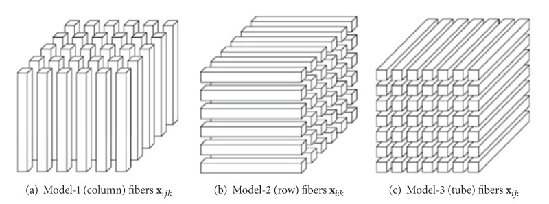
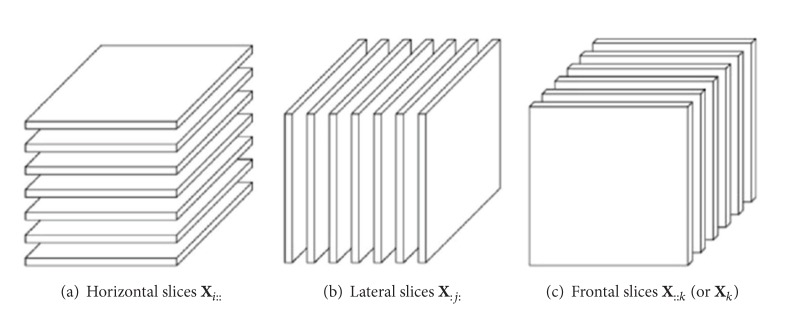
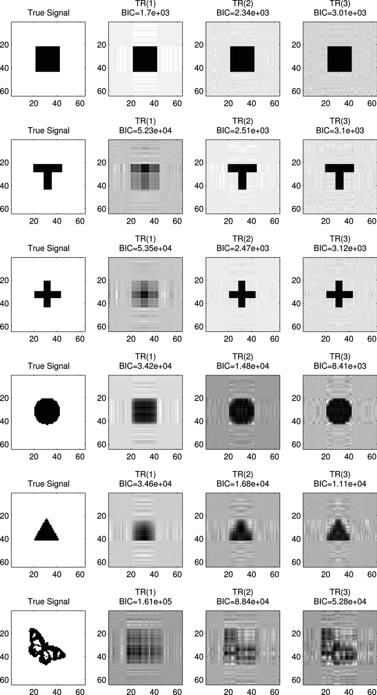
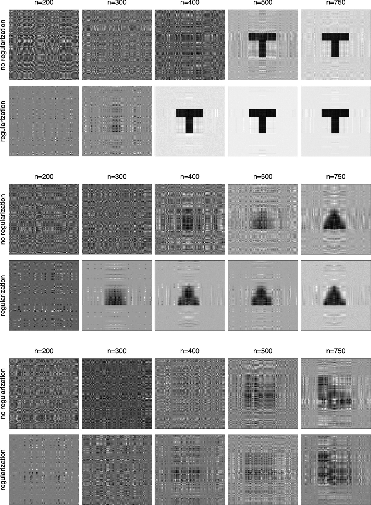

```{r setup, include=FALSE}
knitr::opts_chunk$set(echo = FALSE)
```

## Computer Vision


## TensorFlow


##
\title{Provable Sparse Tensor Decomposition}
\author{Sun, W., Lu, J., Liu, H. and Cheng, G. JRSS-B. (2016)}
\date{}
\maketitle

## Notation
- $[d] = \{1, \ldots, d\}$
- $\circ$ be the outer product between vectors
- $a_n = \Omega(b_n)$ if $b_n = O(a_n)$

## Preliminary
For a third-order tensor $T \in R^{d_1 \times d_2 \times d_3 }$, the mode-1 fiber is given by $[T ]_{:,j,l}$, mode-2 fiber by $[T ]_{i,:,l}$ and mode-3 fiber by $[T ]_{i,j,:}$.



## Preliminary
We similarly define a slice of a tensor by fixing all but two of the indices. For instance, the slice along mode-1 is given as $[T]_{i,:,:}$.



## Preliminary
For a vector $u^{(k)} \in R^{d_k}$ with $k = 1, 2, 3$, we define the mode-1, mode-2, and mode-3 vector product as,
\begin{gather*}
T \times_1 u^{(1)} := \sum_{i \in [d_1]}u_i^{(1)}[T]_{i,:,:};\\
T \times_2 u^{(2)} := \sum_{j \in [d_2]}u_j^{(2)}[T]_{:,j,:};\\
T \times_3 u^{(3)} := \sum_{l \in [d_3]}u_l^{(3)}[T]_{:,:,l}.
\end{gather*}
which are the multilinear combinations of the tensor slices.

## Preliminary
We also define the multilinear combination of the tensor mode-1 fibers and the multilinear combination of the tensor entries as
\begin{gather*}
T \times_2 u^{(2)} \times_3 u^{(3)} := \sum_{j, l} u_j^{(2)} u_l^{(3)} [T]_{:,j,l};\\
T \times_1 u^{(1)} \times_2 u^{(2)} \times_3 u^{(3)} := \sum_{i, j, l} u_i^{(1)} u_j^{(2)} u_l^{(3)} [T]_{i,j,l}.
\end{gather*}

## Preliminary
We define the spectral norm of a tensor $T$ as $$||T|| := \sup_{||u||=||v||=||w||=1} |T \times_1 u \times_2 v \times_3 w|$$ and its Frobenius norm as $$||T||_F := \sqrt{\sum_{i, j, l} [T]^2_{i, j, l}}$$

## Tensor Decomposition
A tensor $T \in R^{d_1 \times d_2 \times d_3}$ is said to have a rank $K$ if it can be written as the sum of $K$ rank-1 tensors, that is
$$T = \sum_{i \in [K]} w_i a_i \circ b_i \circ c_i,$$ where $w_i \in R$ and $ai \in R^{d_1}, bi \in R^{d_2}, ci \in R^{d_3}$. 

Here, we assume $a_i, b_i, c_i$ to be unit vectors, since otherwise the normalized terms can be incorporated in the coefficient $w_i$.

## Tensor Power Method
In the simplest case where $K = 1$, the single-factor tensor decomposition solves $\min ||T - wa \circ b \circ c||_F$ subject to $||a|| = ||b|| = ||c|| = 1$ and $w > 0$, whose solution is given by Allen (2012) as,
$$\hat{a} = \mbox{Norm}(\hat{T} \times_2 b \times_3 c), \hat{b} = \mbox{Norm} (\hat{T} \times_1 a \times_3 c),  \hat{c} = \mbox{Norm} (\hat{T} \times_1 a \times_2 b),$$ where $\mbox{Norm} (v) = v / ||v||$ is a normalization operator on a vector $v$. This procedure provides an
iterative coordinate update procedure for the single-factor tensor decomposition. 

## Model
We assume that $T \in R^{d_1 \times d_2 \times d_3}$ is sparse and has rank $K$ such that 
\begin{equation} \label{decomp}
T = \sum_{i \in [K]} w_i a_i \circ b_i \circ c_i, w_i \in R, a_i \in S^{d_1 - 1}, b_i \in S^{d_2 - 1}, c_i \in S^{d_3 - 1},
\end{equation}
where $S^{d - 1}(R) = \{v \in R^d | ||v|| = 1\}$ and $||a_i||_0 \le d_{01}, ||b_i||_0 \le d_{02}, ||c_i||_0 \le d_{03}$ for any $i \in [K]$. 

Moreover, we assume $w_{\max} = w_1 \ge \cdots \ge w_K = w_{\min} > 0$ and assume each $w_i$ to be bounded away from 0 and $\infty$.

## Algorithm
\scalebox{0.75}{
  \begin{minipage}{\linewidth}
  \begin{algorithm}[H]
  \SetKwInOut{Input}{input}
  \SetKwInOut{Output}{output}
  \SetKw{init}{initialize} 
  \everypar={\nl}
  \Input{tensor $\hat{T} \in R^{d_1\times d_2\times d_3}$, number of initialization $L$, number of iterations $N$, cardinality vector $(s_1,s_2,s_3)$, rank $K$.}
  \For{$\tau=1$ \KwTo $L$}{
    \init{unit vector $\hat{a}_{\tau}^{(0)} \in R^{d_1}, \hat{b}_{\tau}^{(0)} \in R^{d_2}, \hat{c}_{\tau}^{(0)} \in R^{d_3}$.}\\
    \For{$t=1$ to $N$}{
      Alternatively update the components $\hat{a}_{\tau}^{(t)}, \hat{b}_{\tau}^{(t)}, \hat{c}_{\tau}^{(t)}$ as
      \begin{align*}
      \bar{a}_{\tau}^{(t)}=\mbox{Norm}(\hat{T}\times_2\hat{b}_{\tau}^{(t-1)}\times_3\hat{c}_{\tau}^{(t-1)});\breve{a}_{\tau}^{(t)}=\mbox{Truncate}(\bar{a}_{\tau}^{(t)},s_1);\hat{a}_{\tau}^{(t)}=\mbox{Norm}(\breve{a}_{\tau}^{(t)}),\\
      \bar{b}_{\tau}^{(t)}=\mbox{Norm}(\hat{T}\times_1\hat{a}_{\tau}^{(t-1)}\times_3\hat{c}_{\tau}^{(t-1)});\breve{b}_{\tau}^{(t)}=\mbox{Truncate}(\bar{b}_{\tau}^{(t)},s_2);\hat{b}_{\tau}^{(t)}=\mbox{Norm}(\breve{b}_{\tau}^{(t)}),\\
      \bar{c}_{\tau}^{(t)}=\mbox{Norm}(\hat{T}\times_1\hat{a}_{\tau}^{(t-1)}\times_2\hat{b}_{\tau}^{(t-1)});\breve{c}_{\tau}^{(t)}=\mbox{Truncate}(\bar{c}_{\tau}^{(t)},s_3);\hat{c}_{\tau}^{(t)}=\mbox{Norm}(\breve{c}_{\tau}^{(t)}).
      \end{align*}
    }
  }
  \Output{the cluster centers $(\hat{a}_j,\hat{b}_j,\hat{c}_j),j\in[K]$ by clustering $\{(\hat{a}_{\tau}^{(N)},\hat{b}_{\tau}^{(N)},\hat{c}_{\tau}^{(N)}),\tau\in[L]\}$ into $K$ clusters and their corresponding $\hat{w}_j=\hat{T} \times_1\hat{a}_j\times_2\hat{b}_j\times_3\hat{c}_j$}
  \end{algorithm}
  \end{minipage}
}

## Noise Measure
To quantify the noise level of the error, we define the sparse spectral norm of $\epsilon$ as
$$\eta(\epsilon, d_{01}, d_{02}, d_{03}) := \sup_{\substack{||u||=||v||=||w||=1\\ ||u||_0 \le d_{01}, ||v||_0 \le d_{01}, ||w||_0 \le d_{03}}}|\epsilon \times_1 u \times_2 v \times_3 w|$$
Denote $d_0 = \max\{d_{01}, d_{02}, d_{03}\}$, we have $\eta(\epsilon, d_{01}, d_{02}, d_{03}) \le \eta(\epsilon, d_0, d_0, d_0)$ and for simplicity we denote $\eta(\epsilon, d_0) := \eta(\epsilon, d_0, d_0, d_0)$.

## Distance Measure
In order to compute the distance between the estimator and the truth, we define the distance  measure between two unit vectors $u, v \in R^d$ as
$$D(u, v) := \sqrt{1 - (u^T v)^2}.$$ The distance function $D(u, v)$ resolves the sign issue in the decomposition components since changing the signs of any two components vectors while fixing the third component vector will not affect the generated tensor.

## Assumption 3.1 (Identifiability)
The tensor decomposition of $T$ in (\ref{decomp}) is unique in the sense that if the tensor has another decomposition $T = \sum_{i \in [K']} w_i' a_i' \circ b_i' \circ c_i'$ with $a_i' \in S^{d_1-1}, b_i' \in S^{d_2-1}, c_i' \in S^{d_3-1}$ and $w_i' \ne 0$, we have $K = K'$ and there must exist a permutation $\sigma$ of $\{1,\ldots,K\}$ such that $w'_{\sigma(i)} = w_i, a'_{\sigma(i)} = a_i, b'_{\sigma(i)} = b_i$ and $c'_{\sigma(i)} = c_i$.

## Assumption 3.2 (Incoherence)
The decomposition components are incoherent such that
$$\zeta := \max_{i \ne j}\{|\langle a_i, a_j\rangle|, |\langle b_i, b_j\rangle|, |\langle c_i, c_j\rangle|\} \le \frac{c_0}{\sqrt{d_0}},$$
with $d_0 = \max\{d_{01},d_{02},d_{03}\}$ and for any $j$, $||\sum_{i \ne j}w_i\langle a_i, a_j\rangle\langle b_i, b_j\rangle c_j|| \le C_1 w_{\max}\sqrt{K}\zeta$. Moreover, matrices $A := [a_1, \cdots, a_K], B := [b_1,\cdots, b_K]$, and $C := [c_1, \cdots, d_K]$ satisfy $\max\{||A||, ||B||, ||C||\} \le 1 + C_2 \sqrt{K/d_0}$ for some positive constants $C_0, C_1, C_2.$ 

## Remark 3.3
Kruskal (1976, 1977) provide the classical condition of the identifiability of tensor decomposition, that is, it is sufficient for the uniqueness of the decomposition in (\ref{decomp}) if $k_A+k_B+k_C\ge 2K+2$, where $k_A, k_B, k_C$ are the Kruskal ranks of the matrices $A, B, C$. 

Under the overcomplete case that K > max{d1, d2, d3}, Chiantini and Ottaviani (2012) prove that the set of tensors not having a unique tensor decomposition has Lebesgue measure zero and show that the generic identifiability condition holds if $K \le (d1 + 1)(d2 + 1)/16$. Therefore, Assumption 3.1 is satisfied for most of the tensor decomposition problems.

## Remark 3.4
The incoherence condition can be viewed as a relaxation of the orthogonality of decomposition components. It is originally introduced by Donoho and Huo (2001) and has been widely studied in high-dimensional scenarios, for example, compressed sensing (Candes and Romberg, 2007) and matrix decomposition (Chandrasekaran et al., 2012). 

In the experiments, we will illustrate that the incoherence condition of Assumption 3.2 holds if the components $a_i,b_i,c_i$ are randomly generated from the unit and sparse space.

## Error Term
Recall that $\epsilon$ is the tensor of perturbation error, $d_0 = \max\{d_{01}, d_{02}, d_{03}\}$ is the maximal number of nonzero elements in the true decomposition components, $s = \max\{s_1,s_2,s_3\}$ is the maximal number of nonzero elements in the estimated decomposition components from the algorithm, and $K$ is the tensor rank.

Denote the error
\begin{equation} \label{err}
\epsilon_R := \frac{2\sqrt{5}}{w_{\min}}\eta(\epsilon, d_0 + s) + \frac{2\sqrt{5}C_1w_{\max}}{w_{\min}}\sqrt{K}\zeta^2.
\end{equation}
The first term in (\ref{err}) represents the sample error caused by the perturbation tensor $\epsilon$ and the second term is the model error characterized by the incoherent parameter $\zeta$. If the eigenvectors are orthogonal, the incoherent parameter $\zeta = 0$ and the model error in (\ref{err}) disappears.

## Assumption 3.5 (Initialization)
Define the initialization error $\epsilon_0 \:= \max\{D(\hat{a}^{(0)}, a_j), D(\hat{b}^{(0)}, b_j)\}$
for some $j \in [K]$. We assume that
$$\epsilon_0 \le \gamma := \min\{\frac{w_{\min}}{6w_{\max}} - \frac{C_1 \sqrt{K}}{d_0}, \frac{w_{\min}}{4\sqrt{5}C_3w_{\max}}- \frac{2C_0}{C_3\sqrt{d_0}}(1 + C_2\sqrt{\frac{K}{d_0}})^2 \}.$$
Given $\hat{a}^{(0)}, \hat{b}^{(0)}$, the sparse vector $\hat{c}^{(0)}$ is calculated based on the equation in the algorithm.

## Theorem 3.6 (Local statistical rate)
Consider the model in (\ref{decomp}) satisfying Assumptions 3.1 and 3.2, and assume $||T|| \le C_3w_{\max}$ and $K = o(d_0^{3/2})$ with $d_0 = \max\{d_{01}, d_{02}, d_{03}\}$. Let $\hat{T}$ be an input to the algorithm. Assume the perturbation error satisfies $\eta(\epsilon, d_0 + s) \le w_{min}/6$ and the
initialization $(\hat{a}^{(0)},\hat{b}^{(0)}, \hat{c}^{(0)})$ satisfies Assumption 3.5 for some $j \in [K]$. The solution from the inner loop of the algorithm with $s_i \ge d_{0i}$ for $i = 1, 2, 3$, after $N = \Omega(\log(\epsilon_0/\epsilon_R))$  iterations, satisfies with high probability,
$$\max\{D(\hat{a}^{(N)}, a_j),D(\hat{b}^{(N)},b_j), D(\hat{c}^{(N)},c_j)\} \le O(\epsilon_R).$$ Moreover, let $\hat{w} = \hat{T} \times_1 \hat{a}^{(N)} \times_2 \hat{b}^{(N)} \times_3 \hat{c}^{(N)}$, then we have $|\hat{w} - w_j| \le O(\epsilon_R)$ with high probability.

## Remark 3.7
It is worth noting that in the high dimensional regimes, our error rate $\epsilon_R$ significantly improves the rate shown in Anandkumar et al. (2014). Under certain conditions, Anandkumar et al. (2014) prove that their method is able to recover the decomposition with an error rate $O(\eta(\epsilon, d) + \sqrt{K}/d)$ when $d_1 = d_2 = d_3 = d$. In the high-dimensional regimes where $d$ is large, this error is dominated by the sample error $\eta(\epsilon, d)$, which is significantly larger than our sample error $\eta(\epsilon, d_0+s)$.

## Theorem 3.9 (Global statistical rate)
Consider model in (\ref{decomp}) satisfying Assumptions 3.1 and 3.2, and assume $||T|| \le C_3 w_{\max}$ and $K = O(d_0)$ with $d_0 = \max\{d_{01}, d_{02}, d_{03}\}$. Let $\hat{T}$ be an input to the algorithm. Assume the perturbation error satisfies $\eta(\epsilon, d_0 + s) \le \min \{w_{\min}/6, (w_{\min}/C_5) \sqrt{\log K/s}\}$ for some constant $C_5 > 0$. Let the number of initializations $L = K^{\Omega(\gamma^{-4})}$ with $\gamma$ defined in Assumption 3.5 and the number of iterations $N = \Omega(\log(\gamma/\epsilon_R)).$ For any $j \in [K]$, the output of our algorithm with $s_i \ge d_{0i}$ for $i = 1, 2, 3$ satisfies
\begin{gather*}
\max\{D(\hat{a}_j, a_j), D(\hat{b}_j, b_j), D(\hat{c}_j, c_j)\} \le O(\epsilon_R),\\
|\hat{w}_j - w_j| \le O(\epsilon_R),
\end{gather*}
with high probability.

## Practical Choice of Tuning Parameters
Theorem 3.9 provides a theoretical condition on the number of iterations $L = K^{\Omega(\gamma^{-4})}$, which is a polynomial function of $K$. Based on our extensive experiments, we find that in practice it is sufficient to choose $L = \max\{10, K^3\}$.

Moreover, in practice we do not need to specify the number of iterations $N$ in advance, instead we set a termination condition of the truncated power update in the algorithm as
$$\mbox{max}\{||\hat{a_{\tau}}^{(t)} - \hat{a_{\tau}}^{(t - 1)}||, ||\hat{b_{\tau}}^{(t)} - \hat{b_{\tau}}^{(t - 1)}||, ||\hat{c_{\tau}}^{(t)} - \hat{c_{\tau}}^{(t - 1)}||\} \le 10^{-4},$$ 
for each iteration $\tau$.

## Practical Choice of Tuning Parameters
Given a pre-specified set of rank values K and a pre-specified set of cardinality values $S_1, S_2, S_3$, we choose the combination of parameters $(\hat{K}, \hat{s_1}, \hat{s_2}, \hat{s_3})$ which minimizes
\begin{align*}
BIC :=& \log \left(\frac{||T - \sum_{i \in [K]} w_i a_i \circ b_i \circ c_i||_F^2}{d_1 d_2 d_3}\right) + \\
&\frac{\log (d_1 d_2 d_3)}{d_1 d_2 d_3} \left[\sum_{i \in [K]}(||a_i||_0 + ||b_i||_0 + ||c_i||_0)\right]
\end{align*}

## Comparison with Competitive Methods
We compare our TTP method with two competitors: the non-sparse tensor decomposition method in Anandkumar et al. (2014) and the lasso penalized sparse tensor decomposition method in Allen (2012).
\begin{table}
\centering
\begin{tabular}{ cc|cc } 
\hline
\hline
Scenarios & Methods & mean error & weight error \\
\hline
I & Non-sparse & $0.295_{0.0218}$ & $0.053_{0.0084}$ \\
 & Lasso & $0.258_{0.0294}$ & $0.016_{0.0058}$  \\
 & Ours & $0.171_{0.0253}$ & $0.021_{0.0053}$  \\
\hline
II & Non-sparse & $0.300_{0.0195}$ & $0.067_{0.0128}$  \\
 & Lasso & $0.204_{0.0148}$ & $0.008_{0.0013}$  \\
 & Ours & $0.185_{0.0224}$ & $0.022_{0.0056}$ \\
\hline
III & Non-sparse & $0.086_{0.0144}$ & $0.015_{0.0101}$  \\
 & Lasso & $0.055_{0.0029}$ & $0.002_{0.0004}$ \\
 & Ours & $0.036_{0.0042}$ & $0.002_{0.0004}$ \\
\hline
IV & Non-sparse & $0.196_{0.0416}$ & $0.071_{0.0260}$ \\
 & Lasso & $0.052_{0.0018}$ & $0.002_{0.0003}$ \\
 & Ours & $0.041_{0.0064}$ & $0.002_{0.0003}$ \\
\hline
\hline
\end{tabular}
\end{table}

##
\title{On Tensor Completion via Nuclear Norm Minimization}
\author{Yuan, M., Zhang, CH. Found Comput Math (2016) 16: 1031.}
\date{}
\maketitle

## Tensor Completion
Let $T \in R^{d_1\times d_2\times\cdots\times d_N}$ be an $N$th order tensor, and $\Omega$ be a randomly sampled subset of $[d_1]\times\cdots\times [d_N]$ where $[d] = {1,2,\ldots,d}$. The goal of tensor completion is to recover $T$ when observing only entries $T(\omega)$ for $\omega \in \Omega$.

## Matrix Completion
In particular, when $N = 2$, this becomes the so-called matrix completion problem which has received considerable amount of attention in recent years.

An especially attractive approach is through nuclear norm minimization:
$$\mbox{min}_{X \in R^{d_1 \times d_2}} ||X||_* \mbox{ subject to } X(\omega) = T(\omega) \quad \forall \omega \in \Omega,$$
where the nuclear norm $||\cdot||_*$ of a matrix is given by
$$||X||_* = \sum_{k=1}^{\mbox{min}\{d_1, d_2\}} \sigma_k (X),$$
and $\sigma_k(\cdot)$ stands for the $k$th largest singular value of a matrix.

## Matrix Completion
If an unknown $d_1 \times d_2$ matrix $T$ of rank $r$ is of low coherence with respect to the canonical basis, then it can be perfectly reconstructed by $T$ with high probability whenever 
$$|\Omega| \ge C(d_1 + d_2)r \log^2(d_1 + d_2),$$
where $C$ is a numerical constant. 

The seemingly innocent task of generalizing these ideas from matrices to higher order tensor completion problems, however, turns out to be rather subtle, as basic notion such as rank, or singular value decomposition, becomes ambiguous for higher order tensors.

## Matricization Approach
Following the matricization approach, $T$ can be reconstructed by the solution of the following convex program:
$$\mbox{min}_{X \in R^{d_1 \times d_2 \times d_3}} \{||X^{(1)}||_* + ||X^{(2)}||_* + ||X^{(3)}||_*\} \mbox{ subject to } X(\omega) = T(\omega),$$
where $X^{(j)}$ is a $d_j \times (\prod_{l \ne j}d_k)$ matrix whose columns are the mode-$j$ fibers of $X$.

In the light of existing results on matrix completion, with this approach, T can be reconstructed perfectly with high probability provided that
$$|\Omega| \ge C(d_1d_2r_3 + d_1r_2d_3 + r_1d_2d_3)\log^2(d_1+d_2+d_3)$$
uniformly sampled entries are observed, where $r_j$ is the rank of $X^{(j)}$ and $C$ is a numerical constant.

## Nuclear Norm Minimization Formulation
For two tensors $X, Y \in R^{d_1\times d_2\times d_3},$
$$\langle X, Y\rangle=\sum_{\omega \in [d_1]\times [d_2]\times [d_3]}X(\omega)Y(\omega)$$
as their inner product. Define
$$||X||=\max_{u_j\in R^{d_j}:||u_1||=||u_2||=||u_3||=1}\langle X,u_1\otimes u_2\otimes u_3\rangle,$$
where, with slight abuse of notation, $||\cdot||$ also stands for the usual Euclidean norm for a vector.

Another tensor norm of interest is the entrywise $l_{\infty}$ norm, or tensor max norm:
$$||X||_{\max}=\max_{\omega\in[d_1]\times[d_2]\times[d_3]}|X(\omega)|.$$

## Nuclear Norm Minimization Formulation
Appealing to the duality between the spectral norm and nuclear norm in the matrix case, we now consider the following nuclear norm for tensors:
$$||X||_* = \max_{Y\in R^{d_1\times d_2 \times d_3}:||Y||\le 1}\langle Y,X\rangle.$$
It is clear that $||X||_*$ is also a norm. We then consider reconstructing $T$ via the solution to the following convex program:
$$\min_{X\in R^{d_1\times d_2 \times d_3}}||X||_*\mbox{ subject to }X(\omega)=T(\omega) \quad\forall \omega\in\Omega.$$

## Decomposition
Consider the following tensor decomposition of X into rank-one tensors:
$$X=[A,B,C]:= \sum_{k=1}^ra_k\otimes b_k\otimes c_k,$$
where $a_k$s, $b_k$s and $c_k$s are the column vectors of matrices $A, B$ and $C$ respectively. Such a decomposition in general is not unique. However, the linear spaces spanned by columns of $A, B$ and $C$ respectively are uniquely defined.

## Decomposition
More specifically, write $X(\cdot, b, c) = (X(1, b, c), . . . , X(d_1, b, c))^T$, that is the mode-1 fiber of $X$. Define $X(a, \cdot, c)$ and $X(a, b, \cdot)$ in a similar fashion. Let
\begin{gather*}
L_1(X) = \mbox{l.s.}\{X(\cdot,b,c):1\le b\le d_2, 1\le c\le d_3\};\\
L_2(X) = \mbox{l.s.}\{X(a,\cdot,c):1\le a\le d_1, 1\le c\le d_3\};\\
L_3(X) = \mbox{l.s.}\{X(a,b,\cdot):1\le a\le d_1, 1\le b\le d_2\},
\end{gather*}
where l.s. represents the linear space spanned by a collection of vectors of conformable dimension. Then it is clear that the linear space spanned by the column vectors of $A$ is $L_1(X)$, and similar statements hold true for the column vectors of $B$ and $C$.

## "Tensor Ranks"
In the case of matrices, both marginal linear spaces, $L_1$ and $L_2$ are necessarily of the same dimension as they are spanned by the respective singular vectors. For higher order tensors, however, this is typically not true. We shall denote by $r_j(X)$ the dimension of $L_j(X)$ for $j = 1,2$ and 3, which are often referred to the Tucker ranks of $X$. 

Another useful notion of "tensor rank" for our purposes is
$$\bar{r}(X)=\sqrt{(r_1(X)r_2(X)d_3 + r_1(X)r_3(X)d_2 + r_2(X)r_3(X)d_1)/d},$$
where $d = d_1 + d_2 + d_3$, which can also be viewed as a generalization of the matrix rank to tensors. It is well known that the smallest value for $r$ in the rank-one decomposition (\ref{decomp}) is in $[\bar{r}(X),\bar{r}^2(X)].$

## Projection
Let $M$ be a matrix of size $d_0 \times d_1$. Marginal multiplication of $M$ and a tensor $X$ in the first coordinate yields a tensor of size $d_0\times d_2\times d_3$:
$$(M\times_1X)(a,b,c)=\sum_{a'=1}^{d_1}M_{aa'}X(a',b,c).$$
It is easy to see that if $X = [A, B, C]$, then $M \times_1 X = [MA, B, C]$. Marginal multiplications $\times_2$ and $\times_3$ between a matrix of conformable size and $X$ can be similarly defined.

## Projection
Let $P$ be arbitrary projection from $R^{d_1}$ to a linear subspace of $R^{d_1}$. It is clear from the definition of marginal multiplications, $[PA,B,C]$ is also uniquely defined for tensor $X = [A, B, C]$, that is, $[PA, B, C]$ does not depend on the particular decomposition of $A, B, C$. Now let $P_j$ be arbitrary projection from $R^{d_j}$ to a linear subspace of $R^{d_j}$. Define a tensor projection $P_1 \otimes P_2 \otimes P_3$ on $X = [A,B,C]$ as
$$(P_1 \otimes P_2 \otimes P_3)X=[P_1A, P_2B, {P_3C}].$$

Recall that $L_j(X)$ is the linear space spanned by the mode-$j$ fibers of $X$. Let $P^j_X$ be the projection from $R^{d_j}$ to $L_j(X)$ and define
$$Q_X^0=P^1_X \otimes P^2_X \otimes P^3_X.$$

## Coherence
A central concept to matrix completion is coherence. Recall that the coherence of an $r$ dimensional linear subspace $U$ of $R_k$ is defined as
$$\mu(U)=\frac{k}{r}\max_{1\le i\le k}||P_ue_i||^2=\frac{\max_{1\le i\le k}||P_ue_i||^2}{k^{-1}\sum_{i=1}^k||P_ue_i||^2},$$
where $P_U$ is the orthogonal projection onto $U$ and $e_i$’s are the canonical basis for $R_k$.

We shall define the coherence of a tensor $X \in R^{d_1\times d_2\times d_3}$ as
$$\mu(X)=\max\{\mu(L_1(X)), \mu(L_2(X)), \mu(L_3(X))\}.$$
It is clear that $\mu(X) \ge 1$.

## Coherence
Another measure of coherence for a tensor X is
$$\alpha(X):=\sqrt{d_1d_2d_3/\bar{r}(X)}||W||_{\max}$$
where $W$ is such that $W=Q_X^0W, ||W||=1$ and $\langle X,W\rangle=||X||_*$. 

## Exact Tensor Recover
Let $\hat{T}$ be the solution to
\begin{equation}\label{model}
\min_{X\in R^{d_1\times d_2\times d_3}}||X||_*\mbox{ subject to }P_{\Omega}X=P_{\Omega}T,
\end{equation}
where $P_{\Omega}:R^{d_1\times d_2\times d_3} \rightarrow R^{d_1\times d_2\times d_3}$ such that
\[
    (P_{\Omega}X)(i,j,k)=\left\{
                \begin{array}{ll}
                  X(i,j,k) \mbox{ if } (i,j,k)\in\Omega\\
                  0 \mbox{ otherwise}
                \end{array}
              \right.
  \]
Assume that $\Omega$ is a uniformly sampled subset of $[d_1]\times[d_2]\times[d_3]$. The goal is to determine what the necessary sample size is for successful reconstruction of $T$ using $\hat{T}$ with high probability.

## Exact Tensor Recover
Assuem that $\mu(T) \le \mu_0, \alpha(T) \le \alpha_0,$ and $\bar{r}(T) = r.$ Let $\Omega$ be a uniformly sampled subset of $[d_1] \times [d_2] \times [d_3]$ and $\hat{T}$ be the solution to (\ref{model}). For $\beta > 0,$ define 
$$q_1^* = (\beta + \log d)^2 {\alpha_0}^2 r \log d, q_2^* = (1+\beta)(\log d) {\mu_0}^2 r^2.$$
Let $n = |\Omega|.$ Suppose that for a sufficiently large numerical constant $c_0,$
\begin{equation} \label{eq1}
n \ge c_0{\delta_2}^{-1}\left[\sqrt{q_1^*(1+\beta){\delta_1}^{-1}d_1d_2d_3} + q_1^*d^{1+\delta_1} + q_2^*d^{1+\delta_2}\right]
\end{equation} 
with certain $\{\delta_1, \delta_2\} \in \left[\frac 1 {\log d}, \frac 1 2 \right]$ and $\beta >0$. 

## Exact Tensor Recover
Then,
\begin{equation} \label{eq2}
P\left\{\hat{T} \neq T\right\} \le d^{-\beta}.
\end{equation}
In particular, for $\delta_1 = \delta_2 = (\log d)^{-1},$ (\ref{eq1}) can be written as 
$$n \ge C_{\mu_0, \alpha_0, \beta} \left[(\log d)^3 \sqrt{rd_1d_2d_3} + \left\{r(\log d)^3 + r^2(\log d)\right\}d\right]$$ with a constant $C_{\mu_0, \alpha_0, \beta}$ depending on $\{\mu_0, \alpha_0, \beta\}$ only.

## Sample Size Improvement
For $d_1\asymp d_2\asymp d_3$ and fixed $\{\alpha_0,\mu_0, \delta_1, \delta_2, \beta\}$, the sample size requirement (\ref{eq1}) becomes
$$n\asymp \sqrt{r}(d\log d)^{3/2},$$
provided $\max\{r(\log d)^3d^{2\delta_1}, r^3d^{2\delta_2}/(\log d) \} = O(d).$

In the case when the tensor dimension $d$ is large while the rank $r$ is relatively small, this can be a drastic improvement over the existing results based on matricizing tensors where the sample size requirement is $r(d\log d)^2$.

##
\title{Tensor Regression with Applications in Neuroimaging Data Analysis}
\author{Zhou, H., Li, L., and Zhu, H. JASA (2013), 108(502), 540-552.}
\date{}
\maketitle

## Background
In the literature, there have been roughly three categories of statistical methods for establishing association between brain images and clinical traits.

The first is the voxel-based methods, which take each voxel as responses and clinical variables such as age and gender as predictors. A major drawback is that all voxels are treated as independent units and important spatially correlation is ignored (Polzehl, Voss, and Tabelow 2010; Yue, Loh, and Lindquist 2010; Li et al. 2011). 

## Background
The second type of solutions adopts the functional data analysis approach. Generalizations to three-dimensional and higher dimensional images, however, are far from trivial and require substantial research.

The third category employs a two-stage strategy. These methods first carry out a dimension reduction step, often by principal component analysis (PCA), and then fit a regression model based on the top principal components (Caffo et al. 2010). This strategy is intuitive and easy to implement. However, it is well known that PCA is an unsupervised dimension reduction technique and the extracted principal components can be irrelevant to the response.

## Background
Naively turning an image array into a vector is evidently unsatisfactory. For instance, typical anatomical MRI images of size 256-by-256-by-256 implicitly require 2563 = 16,777,216 regression parameters. Both computability and theoretical guarantee of the classical regression analysis are severely compromised by this ultrahigh dimensionality.

More seriously, vectorizing an array destroys the inherent spatial structure of the image that possesses wealth of information.

## Preliminaries
Given two matrices $A = [a_1, \ldots, a_n] \in R^{m \times n}$ and $B =[b_1, \ldots, b_q] \in R^{p \times q}$, the Kronecker product is the $mp$-by-$nq$ matrix $$A \otimes B = [a_1 \otimes B, a_1 \otimes B, \ldots, a_n \otimes B].$$

If $A$ and $B$ have the same number of columns $n = q$, then the Khatri-Rao product (Rao and Mitra 1971) is defined as the $mp$-by-$n$ columnwise Kronecker product $$A \odot B = [a_1 \otimes b_1, a_2 \otimes b_2, \ldots ,a_n \otimes b_n].$$ If $n = q = 1$, then $A \odot B = A \otimes B.$ 

## Preliminaries
Some useful operations transforms a tensor into a matrix/vector. The $vec(B)$ operator stacks the entries of a $D$-dimensional tensor $B \in R^{p_1 \times \ldots p_D}$ into a column vector. 

Specifically, an entry $b_{i_1, \ldots, i_D}$ maps to the $j$th entry of $vec(B)$, in which $j = 1 + \sum_{d = 1}^D (i_d - 1) \prod_{d^\prime = 1}^{d - 1}p_{d^\prime}.$ 

For instance, when $D=2$, the matrix entry $x_{i_1,i_2}$ maps to prosition $j = 1+i_1-1+(i_2-1)p_1 = i_1+(i_2-1)p_1,$ which is consistent with the more familiar $vec$ operation on a matrix. 

## Motivation
In the classical GLM (McCullagh and Nelder 1983) setting, Y belongs to an exponential family with probability mass function or density
\begin{equation}\label{exp}
p(y|\theta,\phi)=\exp\left\{\frac{y\theta - b(\theta)}{a(\phi)}+c(y,\phi)\right\},
\end{equation}
where $\theta$ and $\phi > 0$ denote the natural and dispersion parameters.

The classical GLM relates a vector-valued $X\in R^p$ to the mean $\mu = E(Y|X)$ via $g(\mu) = \eta = \alpha + \beta^TX$, where $g(\cdot)$ is a strictly increasing link function, and $\eta$ denotes the linear systematic part with intercept $\alpha$ and the coefficient vector $\beta\in R^p$.

## Motivation
Next, for a matrix-valued covariate $X \in R^{p_1\times p_2} (D = 2)$, it is intuitive to consider a GLM model with the systematic part given by
$$g(\mu) = \alpha + \beta_1^T X \beta_2,$$
where $\beta_1 \in R^{p_1}$ and $\beta_2 \in R^{p_2}$, respectively. 

The bilinear form $\beta_1^T X \beta_2$ is a natural extension of the linear term $\beta^T X$ in the classical GLM with a vector covariate $X$. Moreover, note that $\alpha + \beta_1^T X \beta_2=(\beta_2\otimes \beta_1)^Tvec(X)$.

## Basic Model
Now for a conventional vector-valued covariate $Z$ and a general array-valued $X \in R^{p_1 \times\cdots\times p_D}$, we propose a GLM with the systematic part given by 
\begin{equation}\label{model2}
g(\mu) = \alpha + \gamma^TZ+(\beta_D\otimes\cdots\otimes \beta_1)^Tvec(X),
\end{equation}
where $\gamma \in R^{p_0}$ and $\beta_d \in R^{p_d}$ for $d =1,\ldots,D.$

The key advantage of model (\ref{model2}) is that it dramatically reduces the dimensionality of the tensor component, from the order of $\prod_d p_d$ to the order of $\sum_d p_d.$

## Tensor Regression Model
We start with an alternative view of the basic model (\ref{model2}), which will lead to its generalization. Consider a $D$-dimensional array variate $X \in R^{p_1 \times\cdots\times p_D}$, and a full coefficient array $B$ of same size that captures the effects of each array element. Then the most flexible GLM suggests a linear systematic part $g(\mu) = \alpha + \gamma^TZ + \langle B,X\rangle$.

If $B$ admits a rank-1 decomposition, that is, $B=\beta_1 \circ \beta_2 \circ\cdots\circ\beta_D$, where $\beta_d \in R^{p_d}$, then we have
\begin{align*}
vec(B)&=vec(\beta_1 \circ \beta_2 \circ\cdots\circ\beta_D)\\
&=\beta_D\odot\cdots\odot\beta_1=\beta_D\otimes\cdots\otimes\beta_1.
\end{align*}

## Tensor Regression Model
Specifically, we propose a family of rank-$R$ generalized linear tensor regression models, in which the systematic part of GLM is of the form
\begin{align} \label{model3}
\begin{split}
g(\mu)&= \alpha+\gamma^TZ + \langle\sum_{r=1}^R\beta_1^{(r)}\circ\cdots\circ\beta_D^{(r)},X \rangle \\
&=\alpha + \gamma^TZ + \langle( B_D\odot\cdots\odot B_1) 1_R, vec(X)\rangle
\end{split}
\end{align}
where $B_d=[\beta_d^{(1)},\ldots,\beta_d^{(R)}]\in R^{p_d\times R}, B_d\odot\cdots\odot B_1\in R^{\prod_d p_d\times R}$ is the Khatri-Rao product and $1_R$ is the vector of $R$ ones. When $R = 1$, it reduces to model (\ref{model2}).

The number of parameters in model (\ref{model3}) is $p_0 + R\sum_d p_d$,  
which is still substantially smaller than $p_0 + \prod_d p_d$.

## Two-Dimensional Shape Examples


## Estimation
Given $n$ iid data $\{(y_i,x_i,z_i),i=1,\ldots,n\},$ the log-likelihood function for (\ref{exp}) is 
$$l(\alpha,\gamma,B_1,\ldots,B_D)=\sum_{i=1}^n\frac{y_i\theta_i - b(\theta_i)}{a(\phi)}+\sum_{i=1}^n c(y_i,\phi),$$
where $\theta_i$ is related to regression parameters $(\alpha, \gamma, B_1, \ldots, B_D)$ through (\ref{model3}). We propose an efficient algorithm for maximizing $l(\alpha,\gamma,B_1,\ldots,B_D)$. 

A key observation is that although $g(\mu)$ in (\ref{model3}) is not linear in $(B_1,\ldots, B_D)$ jointly, it is linear in $B_d$ individually. This suggests alternately updating $(\alpha, \gamma)$ and $B_d, d=1,\ldots,D$, while keeping other components fixed. It yields a so-called block relaxation algorithm (de Leeuw 1994; Lange 2010). 

## Algorithm
\begin{algorithm}[H]
\SetKwInOut{Input}{input}
\SetKwInOut{Output}{output}
\SetKw{init}{initialize} 
\everypar={\nl}
\init{$(\alpha^{(0)}, \gamma^{(0)}) = \argmax_{\alpha, \gamma}l(\alpha, \gamma,0,\ldots,0), B_d^{(0)} \in p_d \times R$ a random matrix for $d = 1, \ldots, D.$}

\Repeat{$l(\theta^{(t+1)}) - l(\theta^{(t)}) < \epsilon$}{
  \For{$d = 1, \ldots, D$}{
    $B_d^{(t+1)} = \argmax_{B_d}l(\alpha^{(t)}, \gamma^{(t)}, B_1^{(t+1)}, \ldots, B_{d-1}^{(t+1)},B_d,B_{d+1}^{(t)}, \ldots, B_D^{(t)})$
  }
  $(\alpha^{(t+1)}, \gamma^{(t+1)}) =\argmax_{\alpha,\gamma}l(\alpha,\gamma,\ldots,B_1^{(t+1)},\ldots,B_D^{(t+1)})$
}
\end{algorithm}

## Theorem 1 (Consistency)
Assume $B_0 = [B_{01},\ldots, B_{0D}] \in B$ is identifiable up to permutation and the array covariates $X_i$ are iid from a bounded distribution. The MLE is consistent, that is, $B_n$ converges to $B_0$ in probability, in the following models: (1) normal tensor regression with a compact parameter space; (2) binary tensor regression; and (3) Poisson tensor regression with a compact parameter space.

## Theorem 2 (Asymptotic normality)
For an interior point $B_0 = [B_{01},\ldots, B_{0D}] \in B$ with nonsingular information matrix $I^{-1}(B_{01},\ldots, B_{0D})$ and $\hat{B}_n$ is consistent,
$$\sqrt{n}[vec(\hat{B}_{n1},\ldots,\hat{B}_{nD})-vec(B_{01},\ldots,B_{0D})]$$
converges in distribution to a normal with mean zero and covariance $T^{-1}(B_{01},\ldots,B_{0D}).$

## Regularized Estimation
Regularization is essential to handle $p > n$, and is also useful for stabilizing the estimates and improving their risk property when $p < n$. there are a large number of regularization techniques for different purposes. 

Here, we illustrate with using sparsity regularization for identifying subregions that are associated with the response traits. This problem can be viewed as an analog of variable selection in the traditional vector-valued covariates. Toward that end, we maximize a regularized log-likelihood function
$$l(\alpha,\gamma,\ldots,B_1,\ldots,B_D) - \sum_{d=1}^{D}\sum_{r=1}^{R}\sum_{l=1}^{p_d}P_{\lambda}(|\beta_{di}^{(r)}|,\rho)$$
where $P_{\lambda}(|\beta|,\rho)$ is a scalar penalty function, $\rho$ is the penalty tuning parameter, and $\lambda$ is an index for the penalty family.

## Regularized Estimation
Regularized estimation for tensor models incurs slight changes in the algorithm. When updating $B_d$, we simply fit a penalized GLM regression problem,
\begin{align*}
B_d^{(t+1)} = &\argmax_{B_d}l(\alpha^{(t)}, \gamma^{(t)}, B_1^{(t+1)}, \ldots, B_{d-1}^{(t+1)},B_d,\\
&B_{d+1}^{(t)}, \ldots, B_D^{(t)}) - \sum_{r=1}^{R}\sum_{l=1}^{p_d}P_{\lambda}(|\beta_{di}^{(r)}|,\rho)
\end{align*}
for which many software packages exist.

## Two-Dimensional Shape Examples (Continued)
The response is normally distributed with mean, $\eta = \gamma^TZ + \langle B, X\rangle$, and standard deviation $\sigma$. $X$ is a $64 \times 64$ two-dimensional matrix, $Z$ is a five-dimensional covariate vector, both of which have standard normal entries, $\gamma = (1, 1, 1, 1, 1)^T$, and $B$ is binary with the true signal region equal to one and the rest zero. 

We fit both a rank-3 tensor model without regularization, and one with a lasso regularization. For sample size, we examine $n =$ 200, 300, 400, 500, and 750. 

## Two-Dimensional Shape Examples (Continued)

